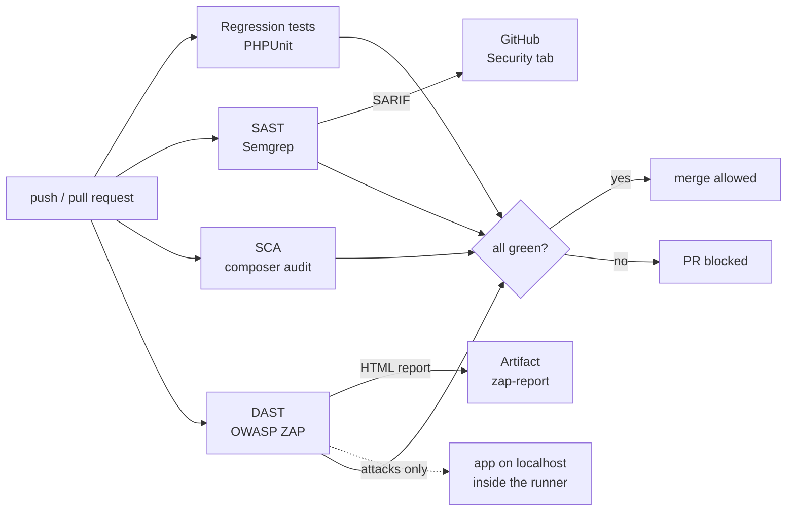

# appsec-pipeline-laravel

[](https://github.com/kayocmadev/appsec-pipeline-laravel/actions/workflows/appsec.yml)

[🇧🇷 Português](README.md) | 🇺🇸 English

> ⚠️ **Intentionally vulnerable application, for educational purposes.** The vulnerable version lives in the [`v1-vulneravel`](https://github.com/kayocmadev/appsec-pipeline-laravel/tree/v1-vulneravel) tag. Do not deploy it.

A **DevSecOps** pipeline on GitHub Actions that blocks insecure code before it reaches `main`, combining complementary checks on a Laravel app:

| Type | Tool | What it looks at |
|---|---|---|
| **SAST** (static analysis) | [Semgrep](https://semgrep.dev) with registry rules + **3 custom rules** | Source code, without running it |
| **SCA** (dependencies) | `composer audit` | `composer.lock` versions against CVE databases |
| **DAST** (dynamic analysis) | [OWASP ZAP](https://www.zaproxy.org) full scan | The running app, attacked from outside |
| **Regression** | PHPUnit | Every real attack replayed as an automated test |

The project tells the full story of an AppSec cycle: **planted flaw → automated detection → fix → green pipeline → documented triage**.

## The pipeline



DAST starts the app **inside the runner itself** and only attacks `127.0.0.1`. No external target is touched.

## The flaws, who found them, and how they were fixed

| # | Flaw | SAST | SCA | DAST | Fix |
|---|---|:-:|:-:|:-:|---|
| VULN-01 | **SQL Injection** in search (`DB::select` with interpolated string) | ✅ custom rule | · | ✅ High | Query Builder with bindings ([`0e8ba40`](https://github.com/kayocmadev/appsec-pipeline-laravel/commit/0e8ba40)) |
| VULN-02 | **Reflected XSS** (`{!! !!}` in Blade) | ✅ custom rule | · | ✅ High | `{{ }}` escapes output ([`3400a14`](https://github.com/kayocmadev/appsec-pipeline-laravel/commit/3400a14)) |
| VULN-03 | **Mass assignment** (`$guarded = []` + `$request->all()`) | ✅ | · | ❌ | `$fillable` + `validate()` ([`faa5259`](https://github.com/kayocmadev/appsec-pipeline-laravel/commit/faa5259)) |
| VULN-04 | **Hardcoded secret** in a controller | ✅ custom rule | · | ❌ | `.env` via `config/services.php` ([`ba7fb23`](https://github.com/kayocmadev/appsec-pipeline-laravel/commit/ba7fb23)) |
| VULN-05 | **Dependency with CVEs** (`phpmailer` 6.4.0: 1 critical + 2 high) | · | ✅ | ❌ | Removed, since it was unused ([`c8d287a`](https://github.com/kayocmadev/appsec-pipeline-laravel/commit/c8d287a)) |
| — | **Missing security headers** (CSP, X-Frame-Options…) | ❌ | · | ✅ Medium | `SecurityHeaders` middleware ([`12391c6`](https://github.com/kayocmadev/appsec-pipeline-laravel/commit/12391c6)) |
| — | **Session cookie without `Secure`** by default | ✅ | · | · | Secure by default ([`bedb596`](https://github.com/kayocmadev/appsec-pipeline-laravel/commit/bedb596)) |

**No single tool catches everything.** ZAP never sees a secret that doesn't show up in an HTTP response. Semgrep never sees a header that only exists when the app is running. That's why the layers complement each other.

## Before and after

| | Before ([tag `v1-vulneravel`](https://github.com/kayocmadev/appsec-pipeline-laravel/tree/v1-vulneravel)) | After ([PR #1](https://github.com/kayocmadev/appsec-pipeline-laravel/pull/1)) |
|---|---|---|
| Pipeline | [❌ red](https://github.com/kayocmadev/appsec-pipeline-laravel/actions/runs/35921653757) | [✅ green](https://github.com/kayocmadev/appsec-pipeline-laravel/actions/runs/35929144903) |
| Semgrep | 6 findings | 0 |
| composer audit | 3 CVEs | 0 |
| ZAP | 3 High, 4 Medium | 0 High/Medium (only triaged Low/Info) |
| ZAP report | [`zap-antes.md`](docs/relatorios/zap-antes.md) | [`zap-depois.md`](docs/relatorios/zap-depois.md) |

Reports are versioned in [`docs/relatorios/`](docs/relatorios/) because GitHub Actions artifacts expire after 90 days.

## Custom Semgrep rules

The registry rules (`p/php`, `p/secrets`, `r/php.laravel`) **missed both the SQL Injection and the XSS**, the two most classic OWASP Top 10 flaws. The secret was only caught because the test key had Stripe's `sk_live_` prefix. So I wrote three rules in [`semgrep-rules/`](semgrep-rules/), each with a test file (`ruleid:` = must flag, `ok:` = must not):

| Rule | Technique | Detail |
|---|---|---|
| `laravel-sqli-raw-query` | **Taint tracking**: source (`$request->input()`…) → sink (1st argument of `DB::select`, `whereRaw`…) | Bindings in the 2nd argument are safe and not flagged |
| `laravel-blade-unescaped-output` | `generic`-mode regex for `{!! !!}` | Ignores text inside Blade comments `{{-- --}}` |
| `laravel-hardcoded-secret` | Matches by **name** (`*key*`, `*secret*`, `*token*`, `*senha*`…) + string literal of 8+ chars | Doesn't depend on any provider's key format |

The rule tests caught two false positives of my own during development. One of them: using `$REQ->get()` as a source matched **any** `->get()`, including Eloquent's.

## Triage

Not every alert is a vulnerability, but no alert is silenced without a written reason:

- **Semgrep:** `laravel-cookie-null-domain` was a false positive (`env('SESSION_DOMAIN')` with no default is already `null`). Fixed by making the default explicit, `env('SESSION_DOMAIN', null)`, instead of silencing the rule.
- **ZAP:** [`.zap/rules.tsv`](.zap/rules.tsv) lists each exception with its justification. Examples:
  - **accepted risk:** `XSRF-TOKEN` without HttpOnly is by Laravel's design;
  - **context false positive:** missing headers only on the static `/robots.txt`, with dynamic pages covered by a test as a compensating control.

## Lessons learned

1. **A tool that only reports doesn't protect.** `semgrep scan` exits 0 even with findings (it needs `--error`), and `composer audit` also exits 0 if the package is on the *ignore* list. A green pipeline with a critical CVE inside is worse than no pipeline.
2. **Composer 2.10 already blocks vulnerable packages at install time.** I had to disable that on purpose to plant VULN-05, and turn it back on in the fix.
3. **Git never forgets.** A Stripe-formatted test key stayed in the first commit even after being deleted. History had to be rewritten before the first push, and GitHub's *push protection* confirmed the result.
4. **Escaping output beats filtering input.** ZAP tried `<scrIpt>`, with mixed case to bypass filters. `{{ }}` escapes **every** `<`, so the trick doesn't work.
5. **Alert names can mislead.** ZAP reported "Buffer Overflow" (not possible in PHP in that sense), but the real cause was missing validation producing a 500 error. It was fixed along with VULN-03 and proven by a test.

## Running locally

Requirement: **Docker** (no local PHP needed).

```bash
git clone https://github.com/kayocmadev/appsec-pipeline-laravel.git
cd appsec-pipeline-laravel

# SAST + SCA + rule tests (0 = clean, 1 = something found)
./scan.sh

# To see everything red, run it on the vulnerable version
git checkout v1-vulneravel && ./scan.sh
```

> On the tag, `scan.sh` is still the old version, which audits `vendor/`. If you already ran `composer install`, delete `vendor/` first, otherwise SCA checks `main`'s dependencies.

Regression tests:

```bash
docker run --rm -u "$(id -u):$(id -g)" -e HOME=/tmp -v "$(pwd)":/app -w /app composer:latest \
  sh -c "composer install -q && cp -n .env.example .env && php artisan key:generate -q && php artisan test"
```

## Layout

```
.github/workflows/appsec.yml              pipeline (tests, sast, sca, dast)
semgrep-rules/                            custom Semgrep rules + test files
.zap/rules.tsv                            justified triage of ZAP alerts
tests/Feature/SegurancaTest.php           regression tests (one per attack)
app/Http/Middleware/SecurityHeaders.php   security headers
docs/relatorios/                          ZAP reports before/after
scan.sh                                   runs the checks locally
```

## Author

**Kayo Cézar** · [GitHub](https://github.com/kayocmadev) · PHP/Laravel developer transitioning into Information Security.
