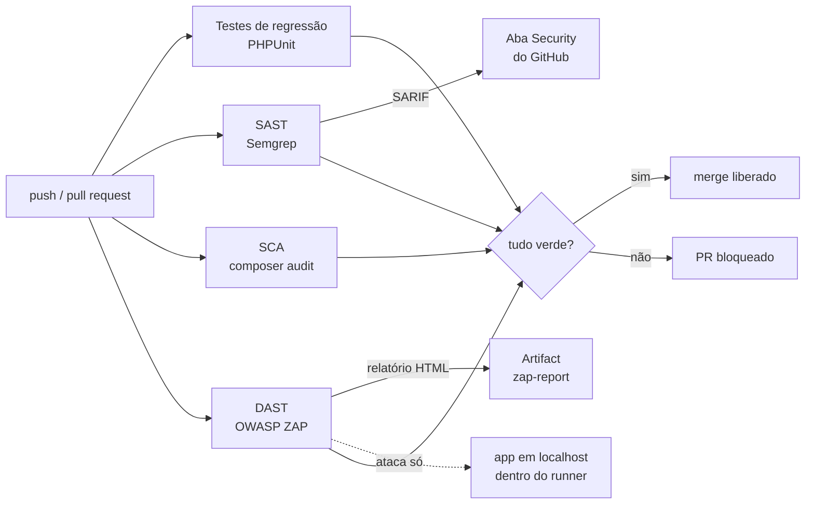

# appsec-pipeline-laravel

[](https://github.com/kayocmadev/appsec-pipeline-laravel/actions/workflows/appsec.yml)

🇧🇷 Português | [🇺🇸 English](README.en.md)

> ⚠️ **Aplicação intencionalmente vulnerável, para fins educacionais.** A versão com as falhas está na tag [`v1-vulneravel`](https://github.com/kayocmadev/appsec-pipeline-laravel/tree/v1-vulneravel). Não faça deploy dela.

Pipeline **DevSecOps** no GitHub Actions que barra código inseguro antes de ele chegar na `main`, combinando verificações complementares sobre uma app Laravel:

| Tipo | Ferramenta | O que olha |
|---|---|---|
| **SAST** (análise estática) | [Semgrep](https://semgrep.dev) com regras prontas + **3 regras próprias** | O código-fonte, sem executar |
| **SCA** (dependências) | `composer audit` | As versões do `composer.lock` contra bases de CVE |
| **DAST** (análise dinâmica) | [OWASP ZAP](https://www.zaproxy.org) full scan | A app rodando, atacada por fora |
| **Regressão** | PHPUnit | Cada ataque real repetido como teste automatizado |

O projeto conta a história completa de um ciclo de AppSec: **falha plantada → detecção automática → correção → pipeline verde → triagem documentada**.

## O pipeline



O DAST sobe a app **dentro do próprio runner** e ataca apenas `127.0.0.1`. Nenhum alvo externo é tocado.

## As falhas, quem achou e como foram corrigidas

| # | Falha | SAST | SCA | DAST | Correção |
|---|---|:-:|:-:|:-:|---|
| VULN-01 | **SQL Injection** na busca (`DB::select` com string interpolada) | ✅ regra própria | · | ✅ High | Query Builder com binding ([`0e8ba40`](https://github.com/kayocmadev/appsec-pipeline-laravel/commit/0e8ba40)) |
| VULN-02 | **XSS refletido** (`{!! !!}` no Blade) | ✅ regra própria | · | ✅ High | `{{ }}` escapa a saída ([`3400a14`](https://github.com/kayocmadev/appsec-pipeline-laravel/commit/3400a14)) |
| VULN-03 | **Mass assignment** (`$guarded = []` + `$request->all()`) | ✅ | · | ❌ | `$fillable` + `validate()` ([`faa5259`](https://github.com/kayocmadev/appsec-pipeline-laravel/commit/faa5259)) |
| VULN-04 | **Segredo hardcoded** no controller | ✅ regra própria | · | ❌ | `.env` via `config/services.php` ([`ba7fb23`](https://github.com/kayocmadev/appsec-pipeline-laravel/commit/ba7fb23)) |
| VULN-05 | **Dependência com CVE** (`phpmailer` 6.4.0: 1 crítico + 2 altos) | · | ✅ | ❌ | Removida, pois não era usada ([`c8d287a`](https://github.com/kayocmadev/appsec-pipeline-laravel/commit/c8d287a)) |
| — | **Headers de segurança ausentes** (CSP, X-Frame-Options…) | ❌ | · | ✅ Medium | Middleware `SecurityHeaders` ([`12391c6`](https://github.com/kayocmadev/appsec-pipeline-laravel/commit/12391c6)) |
| — | **Cookie de sessão sem `Secure`** por padrão | ✅ | · | · | Seguro por padrão ([`bedb596`](https://github.com/kayocmadev/appsec-pipeline-laravel/commit/bedb596)) |

**Nenhuma ferramenta pega tudo sozinha.** O ZAP nunca vê um segredo que não sai na resposta HTTP. O Semgrep nunca vê um header que só existe com a app rodando. Por isso as camadas se complementam.

## Antes e depois

| | Antes ([tag `v1-vulneravel`](https://github.com/kayocmadev/appsec-pipeline-laravel/tree/v1-vulneravel)) | Depois ([PR #1](https://github.com/kayocmadev/appsec-pipeline-laravel/pull/1)) |
|---|---|---|
| Pipeline | [❌ vermelho](https://github.com/kayocmadev/appsec-pipeline-laravel/actions/runs/35921653757) | [✅ verde](https://github.com/kayocmadev/appsec-pipeline-laravel/actions/runs/35929144903) |
| Semgrep | 6 achados | 0 |
| composer audit | 3 CVEs | 0 |
| ZAP | 3 High, 4 Medium | 0 High/Medium (só Low/Info triados) |
| Relatório ZAP | [`zap-antes.md`](docs/relatorios/zap-antes.md) | [`zap-depois.md`](docs/relatorios/zap-depois.md) |

Os relatórios estão versionados em [`docs/relatorios/`](docs/relatorios/) porque os artifacts do GitHub Actions expiram em 90 dias.

## Regras Semgrep próprias

As regras prontas (`p/php`, `p/secrets`, `r/php.laravel`) **não detectaram o SQL Injection nem o XSS**, as duas falhas mais clássicas do OWASP Top 10. O segredo só foi detectado porque a chave de teste tinha o prefixo `sk_live_`, do Stripe. Por isso escrevi três regras em [`semgrep-rules/`](semgrep-rules/), cada uma com arquivo de teste (`ruleid:` = deve acusar, `ok:` = não deve):

| Regra | Técnica | Detalhe |
|---|---|---|
| `laravel-sqli-raw-query` | **Taint tracking**: fonte (`$request->input()`…) → sumidouro (1º argumento de `DB::select`, `whereRaw`…) | Binding no 2º argumento é seguro e não é acusado |
| `laravel-blade-unescaped-output` | Regex no modo `generic` para `{!! !!}` | Ignora texto dentro de comentários Blade `{{-- --}}` |
| `laravel-hardcoded-secret` | Casa pelo **nome** (`*key*`, `*secret*`, `*token*`, `*senha*`…) + string literal de 8+ caracteres | Não depende do formato de chave de nenhum provedor |

Os testes das regras pegaram dois falsos positivos meus durante o desenvolvimento. Um deles: `$REQ->get()` como fonte casava com **qualquer** `->get()`, inclusive o do Eloquent.

## Triagem

Nem todo alerta é vulnerabilidade, mas nenhum alerta é silenciado sem motivo escrito:

- **Semgrep:** `laravel-cookie-null-domain` era falso positivo (`env('SESSION_DOMAIN')` sem padrão já vale `null`). Resolvido deixando o padrão explícito, `env('SESSION_DOMAIN', null)`, em vez de silenciar a regra.
- **ZAP:** [`.zap/rules.tsv`](.zap/rules.tsv) traz cada exceção com a justificativa. Exemplos:
  - **risco aceito:** o `XSRF-TOKEN` sem HttpOnly é design do Laravel;
  - **falso positivo de contexto:** headers ausentes só no `/robots.txt` estático, com as páginas dinâmicas cobertas por teste como controle compensatório.

## Lições aprendidas

1. **Ferramenta que só reporta não protege.** O `semgrep scan` sai com código 0 mesmo com achados (precisa de `--error`), e o `composer audit` também sai com 0 se o pacote estiver na lista de *ignore*. Um pipeline verde com CVE crítico dentro é pior que nenhum pipeline.
2. **O Composer 2.10 já bloqueia pacote vulnerável na instalação.** Foi preciso desligar isso de propósito pra plantar a VULN-05, e religar na correção.
3. **Git não esquece.** Uma chave de teste no formato Stripe ficou no 1º commit mesmo depois de apagada. O histórico teve que ser reescrito antes do primeiro push, e o *push protection* do GitHub confirmou o resultado.
4. **Escapar a saída vence filtrar a entrada.** O ZAP tentou `<scrIpt>`, com letra trocada pra driblar filtros. O `{{ }}` escapa **todo** `<`, então o truque não funciona.
5. **O nome do alerta engana.** O ZAP acusou "Buffer Overflow" (impossível em PHP nesse sentido), mas a causa real era falta de validação gerando erro 500. Foi corrigido junto com a VULN-03 e comprovado por teste.

## Como rodar localmente

Requisito: **Docker** (não precisa de PHP instalado).

```bash
git clone https://github.com/kayocmadev/appsec-pipeline-laravel.git
cd appsec-pipeline-laravel

# SAST + SCA + testes das regras (0 = limpo, 1 = achou problema)
./scan.sh

# Para ver tudo vermelho, rode na versão vulnerável
git checkout v1-vulneravel && ./scan.sh
```

> Na tag, o `scan.sh` ainda é a versão antiga, que audita o `vendor/`. Se você já rodou `composer install`, apague a pasta `vendor/` antes, senão o SCA olha as dependências da `main`.

Para os testes de regressão:

```bash
docker run --rm -u "$(id -u):$(id -g)" -e HOME=/tmp -v "$(pwd)":/app -w /app composer:latest \
  sh -c "composer install -q && cp -n .env.example .env && php artisan key:generate -q && php artisan test"
```

## Estrutura

```
.github/workflows/appsec.yml              pipeline (tests, sast, sca, dast)
semgrep-rules/                            regras Semgrep próprias + arquivos de teste
.zap/rules.tsv                            triagem justificada dos alertas do ZAP
tests/Feature/SegurancaTest.php           testes de regressão (um por ataque)
app/Http/Middleware/SecurityHeaders.php   headers de segurança
docs/relatorios/                          relatórios do ZAP antes/depois
scan.sh                                   roda as verificações localmente
```

## Autor

**Kayo Cézar** · [GitHub](https://github.com/kayocmadev) · Dev PHP/Laravel em transição para Segurança da Informação.
